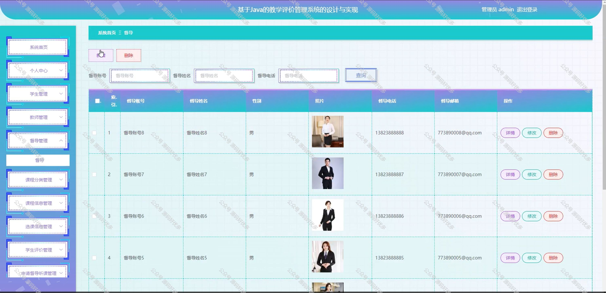

 
## 查看主页获取源码

### 一、作品包含

源码+数据库+全套环境和工具资源+部署教程

### 二、项目技术

前端技术：Html、Css、Js、Vue、Element-ui

数据库：MySQL

后端技术：Java、Spring Boot、MyBatis

  

### 三、运行环境

开发工具：IDEA/eclipse

数据库：MySQL5.7

数据库管理工具：Navicat10以上版本

环境配置软件： JDK1.8+Maven3.6.3

前端Nodejs：14

### 四、项目介绍
项目编号：springbootA265

教学评价管理系统是一个旨在对教学过程进行评估与反馈的教育管理软件。该系统通过收集学生的学习数据、教师的教学行为以及课程的总体表现等信息，对教学质量进行全面而深入的评价。评价结果将及时反馈给教师和学生，以便他们能够根据评价结果调整自己的教学和学习策略，从而提高教学质量和学生满意度。此外，教学评价管理系统还可以帮助教育机构管理者了解学校的整体教学状况，为决策提供有力支持。

前台学生功能：首页、课程信息、系统公告、后台管理、个人中心、我的收藏。

后台分为管理员、学生、教师、督导
管理员的功能：系统首页、个人中心、学生管理、教师管理、督导管理、课程分类管理、课程信息管理、选课信息管理、学生评价管理、申请督导听课管理、督导评价管理、课程成绩管理、系统管理。
学生的功能：系统首页、个人中心、选课信息管理、学生评价管理、课程成绩管理。
教师的功能：系统首页、个人中心、课程信息管理、选课信息管理、学生评价管理、申请督导听课管理、督导评价管理、课程成绩管理。
督导的功能：系统首页、个人中心、申请督导听课管理、督导评价管理。

### 五、运行截图

  
